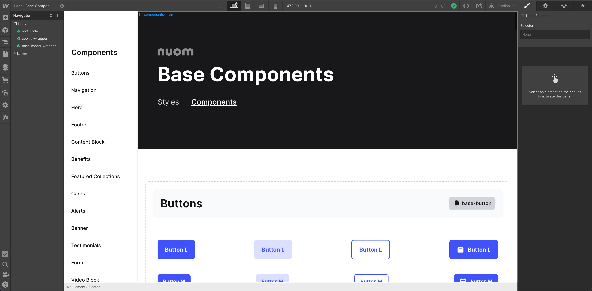
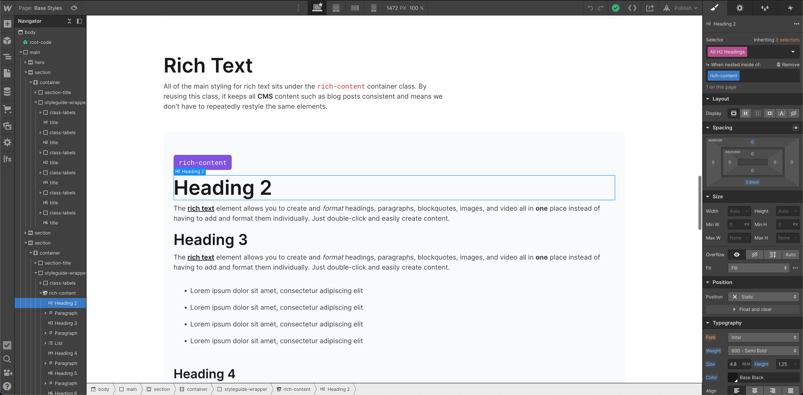
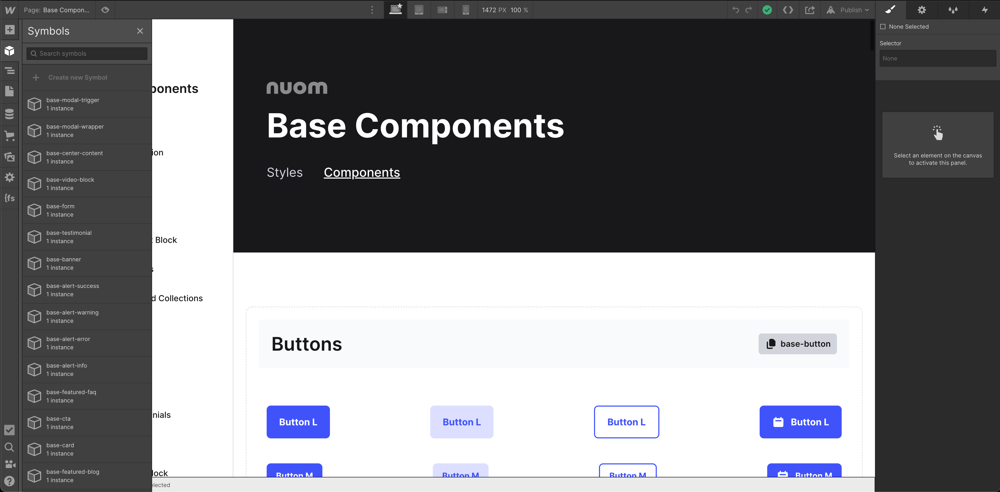

# Styleguide & Best Practice

We’ve developed our own style system to help us build better quality websites, faster. The styleguide also ensures that we maintain consistency across projects so that everyone is aligned on what our best practices are.

We hope to build on this template over time by working out what does and doesn’t work, as well as add more useful components and base styles where we see fit.

**Table of content**

- [How do we style our websites?](#how-do-we-style-our-websites)
- [What sizing units do we use?](#what-sizing-units-do-we-use)
- [How do we structure our pages?](#how-do-we-structure-our-pages)
- [What does the template include?](#what-does-the-template-include)
- [How do I update the base styles?](#how-do-i-update-the-base-styles)
- [Can I delete the styleguide pages?](#can-i-delete-the-styleguide-pages)
- [How do I use the components?](#how-do-i-use-the-components)
- [How do I create the CMS filter?](#how-do-i-create-the-cms-filter)
- [Which domain do I publish to?](#which-domain-do-i-publish-to)
- [How do I update the SEO?](#how-do-i-update-the-seo)
- [How do I organise assets?](#how-do-i-organise-assets)
- [Can I remove unused styles?](#can-i-remove-unused-styles)
- [How do I create new interactions?](#how-do-i-create-new-interactions)
- [Component Documentation](#component-documentation)
- [Building Accessible Websites](#building-accessible-websites)
- [Collecting Feedback](#collecting-feedback)
- [Useful resources](#useful-resources)

---

## How do we style our websites?

To make our components more readable, we use the [BEM](http://getbem.com/) (Block, Element, Modifier) methodology. By [using BEM](https://levelup.gitconnected.com/css-naming-convention-bem-block-element-modifier-2ada852a14d3), we not only make our classes more contextual, but they also help us improve reusability across similar components.

If we have a card component for example, our markup looks a lot like how we’d layer a component in Figma:

As you move around the template, you’ll start to see how we’ve used BEM to make our site much easier to manage, and even scale with the help of modifiers.

Don’t worry if it doesn't make complete sense now; Once you’ve broken down and styled a few elements, everything should fall into place (Although @Curtis Lee will be able to help if you get stuck at any point) 🤓

## What sizing units do we use?

Rather than hardcoding our font sizes using pixels, we instead use more accessible relative units called `rem`.

The `r` stands for `root`, and is related to the root font size that we set. If we were to use pixels, a user who wanted to increase the font size in their browser wouldn’t be able to as the pixel value is absolute, and therefore cannot be changed.

By using a relative unit such as `rem`, if a user was to increase the default font size of their browser, the text would scale as well.

To make our calculations easier, we’ve set the root font size to `10px` (`62.5%`), which means you only need to think in terms of 10x tables (The pixel value divided by 10):

`0.8rem` = `8px`

`1rem` = `10px`

`1.2rem` = `12px`

You can read more about relative units here: [https://www.sitepoint.com/understanding-and-using-rem-units-in-css/](https://www.sitepoint.com/understanding-and-using-rem-units-in-css/)

## How do we structure our pages?

We aim to follow [best HTML practices](https://developer.mozilla.org/en-US/docs/Learn/HTML/Introduction_to_HTML/Document_and_website_structure) when creating our pages so that our site is not only consistent and well organised, but also helps assisted technologies such as screen readers by breaking the page structure into landmarks (Nav, Main, Footer etc).

To standardise our pages, we’ve created a basic template structure that you should be able to easily follow straight away:

Every page SHOULD have the `root-code`, `cookie-wrapper` and a `main` wrapper to house all of the content unique to that page. The components that are the same on every page such as the navigation or footer need to then sit outside of the `main` tag.

To break each section up, we follow the `section` / `container` / `component-wrapper` structure. This makes it easy for us to split the page up into meaningful sections exactly like we’d do in Figma. You can see this is in action on the Blog page for example:

These are fully responsive and ready to go, so all you need to do is makes sure you continue that structure as you add more sections.

---

<aside>
💡 Make sure to DUPLICATE the template before doing any of the below steps.
</aside>

## What does the template include?

The template includes all of the main class names, styling, components and functionality we normally have to set up from scratch. These are anything from the heading and text styles, right down to the interactions needed to make a modal work.

We’ve also built our own basic CMS structure to handle blog posts and FAQs, along with all of the filter logic and conditionals we commonly use. Although the CMS is fully customisable, the basic structure should give you everything we normally need based on previous experiences.

**Here is a breakdown of each part of the template:**

### ⚙️ Project Settings

To begin with, you shouldn’t need to do too much in the settings apart from rename the project and subdomain, add your own [favicons](https://university.webflow.com/lesson/favicons-and-touch-icons#:~:text=Upload%20your%20icons,-Once%20you're&text=Go%20to%20your%20Project%20Setting,to%20see%20the%20updated%20favicon), and import the correct fonts (Make sure to remove the old fonts first):

Under settings is where we also handle the hosting, editor access and other data we need such as SEO, Forms and Integrations. We also have a Custom Code section which stores all of our global scripts. The template code shouldn’t be removed although it may need to be tweaked a little depending on the project needs.

### 🎨 Base Styles

The styles are split into **five** main areas: Titles, Paragraphs, Rich Text, Colours and Layout. These all have a base styling applied and are what we use to define the projects DNA:

**Titles**

For titles, we’ve applied a base class of `title` to style the colour, and then used a modifier such as `xl` to tweak the font size and weight. If you wish to change a specific title’s colour, then use another modifier in order to do so. Here’s an example of how this type of use-case would look: `title` `xl` `white`.

_Note: We’ve opted for the class name `title` instead of heading. Think of titles as the text style, and the heading type (E.g `H1`) as the semantic tag._

**Paragraphs**

Similar to the titles, we have a base class of `text` followed by a modifier such as `lg` to tweak the font size. Unlike the titles, we haven’t set a colour or font-weight for our text styles, but instead let them _inherit_ these attributes from their parent (By default, this is the `body`).

Make sure you don’t change the base style for text when building components, but instead apply any additional styling to a parent wrapper.

_Example: If you have a card with centre aligned text, apply the `text-align: center` to the block `card` container to avoid centring all text with the same class name._

**Rich Text**

We use rich text for all of our blog posts, although it can be used for any CMS feed where content needs to be dynamically updated.

As rich text is formatted in the CMS editor rather than as part of the global styling, we often have to restyle all of the elements so that they are consistent with the rest of the site. To save us from this repetitive pain in the future, we’ve created a single `rich-content` container class to automatically keep all CMS content correctly styled in one go.

_Note: You’ll need to manually update the styles to begin with (which we’ve made extra easy), but you shouldn't need to repeat the process again unless it’s for a very specific use-case ⚡_

**Colours**

You can add as many colours as you need to this section, although we’ve added **four** for now just to give you a bit of a starting point. It’s here that you can start outlining the core palette for a project, and get all of the swatches added for you to reuse anywhere.

_Note: Colour swatches are like variables or tokens that you only need to update once, but can be used multiple times (E.g `Primary Blue`)._

**Layouts**

We predominantly use CSS Grid for big, structural layouts, and Flexbox for smaller layouts that are often at a component level rather than page level.

Grid is great for allowing us to create both simple as well as more 2-dimensional layouts, and Webflow provides a good starting point in helping us do that. Using the native Webflow grids, we’ve set up **three** base containers for you to use anywhere on a project.

These containers are: `grid-2-col`, `grid-3-col`, and `grid-4-col`.

Each of these give us a good foundation, however we recommend using a modifier class to then apply any specific styling such as changing the column gap or breakpoint rules. This should look something like: `grid-3-col` `blog-grid`.

_Note: Not only do the modifiers prevent accidentally breaking the base grid rules, but they are also good for providing further context as to what the grid is being used for._

### 🏗️ Base Components

This page contains a collection of the most commonly used components we’ve built over recent projects. These are by no mean set-in-stone, however they give you a decent foundation with all of the markup in place for you to drag and drop onto any page or section:

All of the components are fully responsive, and utilise both the BEM structure and all of the styles we set up in the `Base Styles` page. You can even copy and paste the components from this page, which we will explain how to do further down.

### 🗂️ CMS Collections

The CMS is fully functional out of the box for both blog posts and FAQs. Apart from styling updates and adding real content, there shouldn’t be much that needs to be done here:

You’ll even find a template page for blog posts, as well as the collection pages for all of the blog cards and FAQs:

If you don’t require any CMS collections for a project, we recommend **ONLY** deleting the `Blog` and `FAQs` pages, but leaving the CMS databases as they are.

We never know if a project is going to require a CMS of some sort later down the line, and it’s always handy to have the scaffolding in place rather than delete it entirely. You should also exclude the `Blog Posts Template` page from search results, just to stop it being accidentally indexed if it’s not needed:

You’ll also find a few other template pages, however they are automatically created when setting up single-use collections such as `authors`, and therefore can be ignored.

### 👾 404 page

The often forgotten page has been taken care of. As all of the base styles will automatically apply, you shouldn’t really need to touch this page unless it’s to add a funny GIF or change the copy:

---

## How do I update the base styles?

When you first start a new project, you’re of course going to want to update the initial base styles such as the font and text colours.

**Updating the global font**

To update the font, you first need to make sure you’ve imported the font-family and all of the required weights into the project settings. From there, it’s just a case of selecting the body tag (The class of `body` should be applied) and changing the font and base colour:

We’ve also set the base font size at `16px` , or (`1.6rem`). _This font size shouldn’t be changed as it’s the default value that browsers use._

**Updating the titles**

If the titles require a different font, then apply that change directly to the base `title` class instead. This can be done using the selector tree on the right:

You can also change the base colour of the headings this way as well. By targeting the base class, you will affect all titles in one go meaning you only need to worry about sizing each one using the modifiers.

**Updating the paragraphs**

The paragraphs work in a similar way to the titles, in that you only need to worry about adjusting the modifier class to set the size of them:

You can also set a main colour for each text style, however by default we let them all inherit the same base colour from the `body` tag. The sizes we have are also very common and don’t go any larger or smaller than what is common across the web, so changes shouldn’t really be needed.

**Styling rich text**

Make sure any changes you make to the titles and paragraphs are also reflected in the rich text:

As tedious as it is, it’s just a case of manually updating each rich text item and making sure they have the same styles as the titles/text above. _Remember, you only need to do this once!_

**Adding colour styles**

Creating colour styles is exactly the same as adding a style in Figma. Simply enter the HEX value, click the add icon and name the swatch:

We’ve even created a few initial styles that you’ll commonly find such as `Primary`, so all you need to do for those is edit the swatch and add whichever HEX value you need 🖌️

## Can I delete the styleguide pages?

Once you’ve set up all of your styles and had a flick through the components page, we recommend deleting the styleguide pages/folder so that Webflow doesn’t have to rebuild them every time you want to publish.

Don’t worry - deleting the components page doesn’t actually delete the components from the `Symbols` tab either, so you’ll still be able to access them.

## How do I use the components?

All of the template components start with the `base-` prefix to help us differentiate the default ones from any new ones you create:

To use these components as a starting point, you can open the master template in the browser to view it live: [https://nuom-project-template.webflow.io/style-system/base-components](https://nuom-project-template.webflow.io/style-system/base-components)

From there, you’l be able to use the copy and paste functionality to grab the elements you need and drop them into your Webflow project.

Simply click the copy button which will include the base-prefix for a component or component set, and then in your Webflow project, press `CMD + K` to open up the search and paste the component name.

This is a handy way of doing things because you get a visual reference as to what the components look like, and it’s much easier to navigate than having to hunt for a component in the Webflow sidebar...

We also recommend right clicking on the component and selecting `Unlink Instance` if you wish to make any drastic or super specific changes to an element.

This isn’t really necessary for elements such as buttons or if the changes are simple, but if you want to start tweaking the structure or creating variations, then detaching the symbol will give you free-reign to experiment without the fear of losing that base component reference.

This workflow also leaves a helpful breadcrumb of what new components needed to be created for a project (Just make sure the new components don’t start with the word `base` 😄).

_Example: You may have multiple card components each with different attributes such as one with a link and one without a link, so this would be a good use-case to detach the symbol and create new ones specific to those requirements._

---

## How do I create the CMS filter?

On the main blog and FAQ pages, we’ve added category links to allow us to filter the CMS items. All of the logic to make this work has been set up, however there will most likely be some manual adjustments that are needed.

As the main legwork has been done, updating things is pretty easy (Although it can be tricky at first, so help is at hand). Using the blog as an example, the process should look like this (Repeat for other collections such as the FAQ):

<aside>
💡 This has since been updated to use the latest ‘Attributes’ library from Finsweet (Specifically their CMS filtering and Load-Under functionality).
</aside>

### Updates // November 2022

Thanks to Finsweet’s latest update, adding complex multi-level filtering, pagination and more is now easier than ever:
[https://www.finsweet.com/attributes/cms-filter](https://www.finsweet.com/attributes/cms-filter)
[https://www.finsweet.com/attributes/cms-load](https://www.finsweet.com/attributes/cms-load)

It’s also a lot more straightforward to create nested CMS collections and override Webflow’s default restriction — this isn’t needed too often but it’s always useful to know if you’re ever creating a filtering system or dynamic tag list using a multi-reference field:

[https://www.finsweet.com/attributes/cms-nest](https://www.finsweet.com/attributes/cms-nest)

_Checkout the Case Study cards on the [nuom site](https://www.nuom.co.uk/case-studies) to see this in action._

Anyway; to update the filters now, you just need to do the following:

**1.**

Update the categories as needed, and then select the correct category for each post in the `Blog Posts` collection.

**2.**

Make sure the correct attribute value is applied, which in our case is `category` — this shouldn’t need to change, but this value is what we’ll use to filter the cards.

**3.**

Update the link text and make sure the text in the `Field Settings` match. If you want to change the `fs-cmsfilter-field` value, you’ll also need to make sure the attribute value matches the value on the card tags mentioned above.

That should be all that is required. You’ll then need to publish the site to test whether the filter works as expected (Any custom scripts won’t work in the Webflow designer).

… Repeat this process for the FAQ’s, or any other filtering system you’re working on.

### ** LEGACY **

**1.**

~~Update the category names for the blog. These can be found under the `Blog Categories` collection list.~~

**2.**

~~Apply the categories to the correct blog posts under the main `Blog Post` collection.~~

**3.**

~~Update the link text and make sure their filter attributes match the name of each category.~~

~~💡 There’s also an `active-category` class as well, which we’ve styled in the `custom-code` embed nested in the categories container. You can control the styling for that class in here, although you shouldn’t need to change much apart from the background colour.~~

---

## Which domain do I publish to?

When we start a new project, we work solely off of the subdomain that is automatically assigned to the project by Webflow. This is our main staging link that we use to demo the site to clients, test out changes and do any updates.

You can tell which is the subdomain by the `.webflow.io` extension.

We normally add the ‘official’ domain once we’ve built the first iteration of the site and are ready to launch. Once the main domain is hooked up and the client is happy, we then deploy the site and let it propagate. At that point, the site is officially LIVE 🚀

If you need to make any future updates or changes, we continue to use the staging domain so that we don’t accidentally break the live site. Doing this is as easy and unchecking the main domain and only publishing to it once the new updates have been signed off.

---

## How do I update the SEO?

The SEO is really simple to update. We normally get given a document that contains the titles and descriptions for each page, so it’s a normally a case of copy and pasting those into the page settings like so:

Make sure to add an OG Image as well, preferably `1200x630` in size. This may be supplied by the client, or you can create one yourself that’s on brand.

Here’s Webflow’s documentation on handling these settings:

[https://university.webflow.com/lesson/seo-title-meta-description](https://university.webflow.com/lesson/seo-title-meta-description)

[https://university.webflow.com/lesson/open-graph-settings](https://university.webflow.com/lesson/open-graph-settings)

---

## How do I organise assets?

Webflow generally throws all of the assets into one collective `All Assets` category. For the most part, this is okay as the most recently added assets appear first in the list anyway and are usually very easy to find.

Sometimes you may need to hunt for a certain icon or image though, and if you’ve added a tonne of assets over the course of the project, this can be pretty annoying. To help ease that problem, we’ve set up a very basic folder structure to organise your assets:

This structure is similar to the one we’ve used on previous projects, and gives you the main categories in which you can organise your assets. You don’t have to stick religiously to this, however it definitely helps to categorise your major assets to save you future headaches and also keep the project feeling tidier.

---

## Can I remove unused styles?

It’s considered best practice to keep on top of the styling panel and remove any and all unused styles where possible, and as often as possible.

Sometimes though, certain classes need to exist in the project even if they aren’t directly being used in the designer (Think spacing utility classes). It’s always best to check first before bulk removing any unused styles (`Clean Up`), just in case.

For the most part though, we recommend making sure you aren’t leaving janky class names such as `Div Block 1` lying around — it’s just good Webflow hygiene as a whole.

We also recommend using the `Embed` block for some classes to avoid the issue of potentially removing them. You can see an example of how we’ve used this method with the blog categories `active-category` class:

Rather than leave the `active-category` class trailing in the unused styles panel, we’ve instead created it as a separate CSS selector and added the styling that way. This means the JS can still add and remove the class, but it isn’t detected by Webflow as being an unused class.

This is great for any `toggle` or `add/removeClass` functions.

---

## How do I create new interactions?

We have some basic interactions set up for a few of our components already, however you can build on this and create some of your own interactions if you need/want to.

You can follow the [Webflow tutorials](https://university.webflow.com/lesson/intro-to-interactions?utm_source=google&utm_medium=search&utm_campaign=general-paid-workhorse&utm_term=keyword-targeting&utm_content=dynamic-search-ads-t1&gclid=Cj0KCQiAr5iQBhCsARIsAPcwRON1Ogu5NbB_iSoANBaEg_hSrmnA_uCYvrjfK6f4VvYiNtXRbgQk8WkaAkX3EALw_wcB) to understand more about how the interactions work, but if you do create any, please follow a similar naming convention to the ones already in there:

`Interaction Element (Function)`

---

## Component Documentation

Check out the component docs we’ve put together, where we breakdown the structure of each of our base components so that you know both what the markup behind them is doing, and what you can do to edit them and debug any issues easily.

[Component Documentation](2-component-documentation.md)

---

## **Building Accessible Websites**

We aim to make our sites as accessible as we can, therefore we’ve written up some basic guidelines for you to be mindful of when building in Webflow, or any websites for that matter.

[Building Accessible Websites](4-building-accessible-websites.md)

---

## Collecting Feedback

To avoid feedback getting lost in the meta, we use a handy tool to store our websites and help everyone document their notes in one place.

[Collecting Feedback](5-collecting-feedback.md)

---

## Useful resources

[https://www.finsweet.com/extension/](https://www.finsweet.com/extension/)

[https://jquery-builder.webflow.io/](https://jquery-builder.webflow.io/)

---

<aside>
💡 Hopefully that covers everything needed to get up and running. As always, feel free to ask @Curtis Lee if you’re unsure of anything or have a question. Happy building 🔥
</aside>
