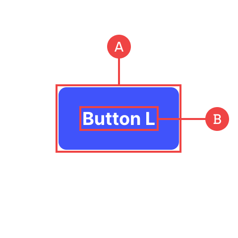
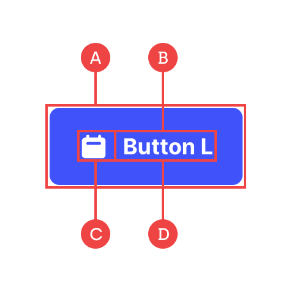

# Buttons

We have four styles of button with three different size variations (Large, Medium, Small). Apart from the ones with icons, all of the buttons follow the same structure:

## Button (Without Icon)

**A:** This is a basic link block that forms the buttons container and controls the colour, padding and text styling/alignment.

**B:** This is the button label which doesn’t have any specific styling as it inherits its properties from the parent container.

## Button (With Icon)

**A:** This is a basic link block that forms the buttons container and controls the colour, padding and text styling/alignment.

**B:** The inner flex wrapper which contains the icon and text label. The flex properties shouldn’t need to be changed as the elements always need to sit horizontally.

**C:** The icon which can be swapped out with any icon you need, or be repositioned to sit on either side of the button. This icon also controls the spacing between the text labels.

**D:** The button label which doesn’t have any specific styling as it inherits its properties from the parent container.
