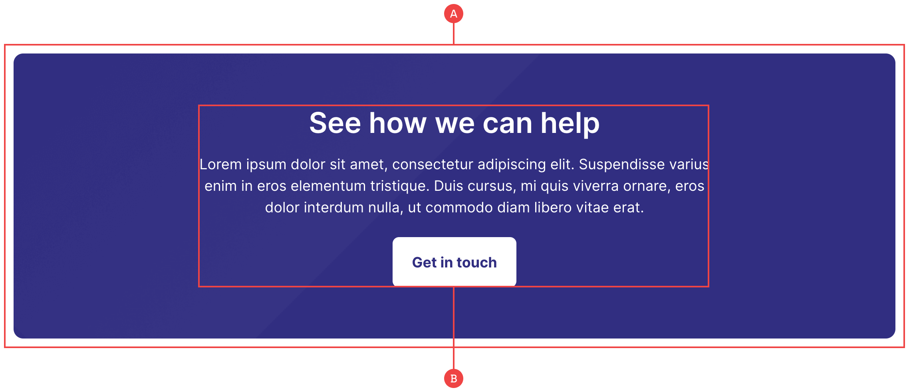

# CTA

This basic CTA features three elements to begin with, although you can also go further and play around with the alignment or add more items as is required:

**A:** The flex container controls the background colour and padding on smaller screens, and works as the wrapper for the CTA in order to position the items within it.

**B:** The inner wrapper is positioned in the centre using Flexbox, and has a fixed width to stop the content from stretching the full 100% and becoming awkward to read. If you do stick with the centred content, make sure the max-width doesn’t go too wide (E.g 640px, or 64rem).
