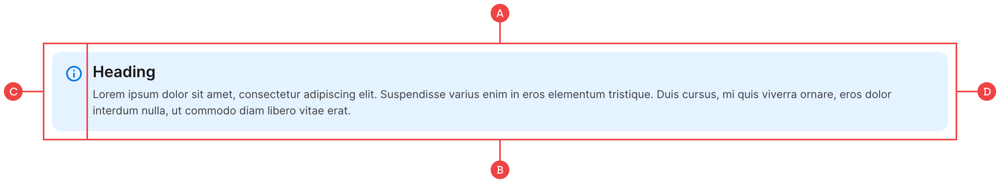

# Alerts

We have four main alerts including Info, Error, Warning and Success. Despite the icons and colours being different, they use the same Flexbox layout and shouldn’t need to change much:

**A:** The main container which sets the background colour and padding.

**B:** The inner flex container that controls the layout at different screen sizes.

**C:** The icon is a standard image tag that sits outside of the content container.

**D:** The content container holds the copy and is there to allow the flex container to position the items correctly.
