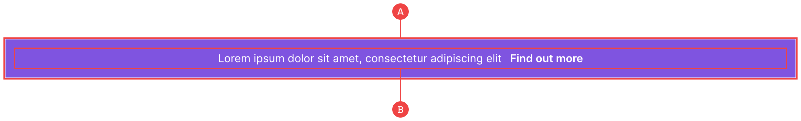

# Banner

Banners can be used for promotional or general messaging that has some level of importance against the main page content, and is often best presented just below the navigation bar:

**A:** The main container sits outside of a section and takes up the full viewport width by default, although the banner can be nested within a section or parent component as well.

**B:** The banner includes our standard container, however we also have an inner wrapper which contains our text and inline link, just to help with component readability.
