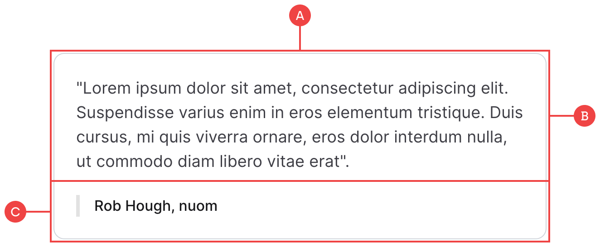

# Testimonials

Testimonials are one of the key components to helping drive trust amongst potential customers, and so we try to include them at various points throughout a site such as on the homepage or service pages:

**A:** We’ve wrapped the testimonial in a vertical flex container so that the client details remain fixed to the bottom at all times when you have multiple testimonials of varying quote lengths.

**B:** The main quote uses the `text lg` combo class, and is nested within a parent container so that we can add some margin to the bottom.

**C:** The client label is just a single text block with a left border added to it, along with 16px of left padding to give the label some space between the border.
