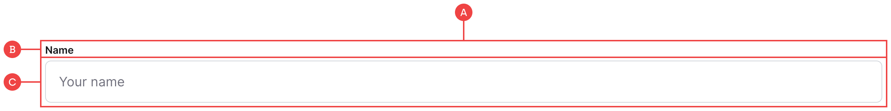
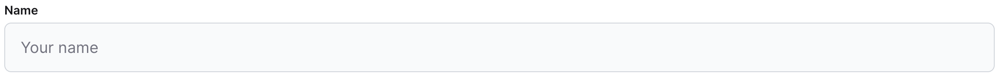
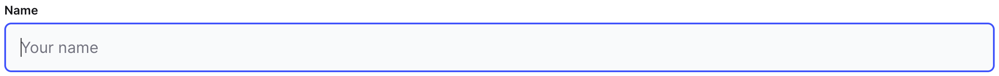
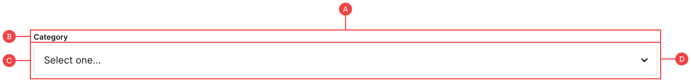
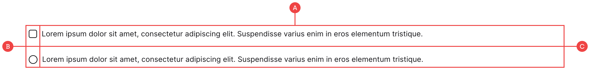
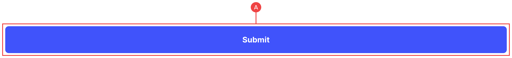
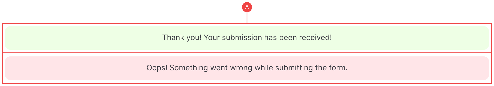

# Inputs

We’ve created all of the initial base styling and functionality for the inputs, so all you really need to do is adjust the colours and sizing as well as the various states.

These inputs are wrapped within a form block with a specific ID and Name (E.g email-form), and is required on all inputs as it is what Webflow uses to `GET` the data from each form item.

<aside>
💡 We’re also going to look into creating our own custom error states and inline validation, however for now we’ve simply styled the native Webflow messages.
</aside>

## Input (Standard Field)







**A:** Each input is wrapped within a container that houses both the label and the input field.

**B:** The label is tied to the name of the input (E.g Email), which can be changed in the settings panel on the right.

**C:** The main input field is where we handle the hover, focus and placeholder states which can be accessed through the state selector under the `input__field` class.

## Input (Dropdown)




**A:** Each input is wrapped within a container that houses both the label and the input field.

**B:** The label is tied to the name of the input (E.g Email), which can be changed in the settings panel on the right.

**C:** The main input field is where we handle the hover, focus and placeholder states which can be accessed through the state selector under the `input__field` class.

**D:** This uses a select dropdown which contains the options found in the right-hand panel (Under settings). This input also has a background image for the chevron icon.

_You can replace the chevron icon using the background-image property directly in the designer._

_If you need to disable the placeholder value, then give the dropdown a unique ID and apply that ID to the code snippet found in the project settings:_

```html
<!-- Disable select input placeholder -->
<script>
  $("#category option:first-child").attr("disabled", "disabled");
</script>
```

## Input (Checkbox & Radio)




**A:** Both types of input are structured in the same way, with the parent container wrapping all of the content under a class such as `checkbox`.

**B:** The main input control is what Webflow natively uses for the two states. You don’t need to worry about these apart from adjusting the colour and the background image using the state selector (I.e the checkmark icon might need to be a different colour).

**C:** The input label that can be changed/styled however you need.

_Webflow takes care of all of the hard stuff, so you only need to worry about styling these as you would any other element._

## Button (Submit)



**A:** Webflow uses a specific form button that handles how the data is posted from the form, so you just need to make sure the styles match the large button styles in your component library (If you need them to match that is).

_We’ve used the BEM naming convention, however you could also use the existing button classes along with a modifier of `form-button` for example._

## Messages (Success & Error)



The ones Webflow provides out of the box really aren’t great, however we’ve updated their styling using the `alert` classes for now. We will look at some form of inline validation, as it’s a much better and expected experience that Webflow has surprisingly neglected.

**A:** As these inherit their colour from the alert classes, any changes to the success and error alerts such as the background colour will also reflect here as well.
