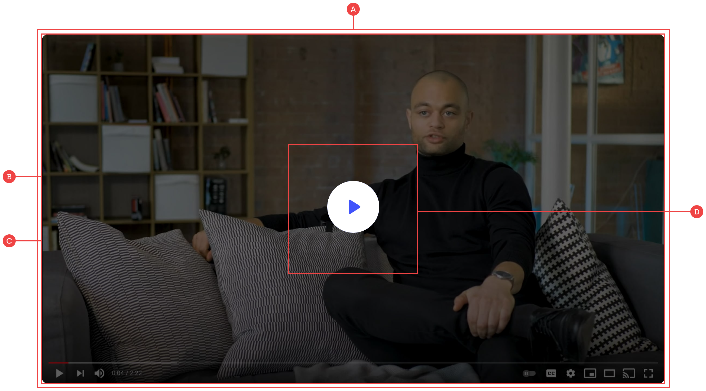

# Video

The video component works using a mix of custom code and Webflow interactions, and the only bit of code you should need to change is the video ID in the iFrame embed:

**A:** The two main parts to this component are the media embed and the overlay, which both sit within a top-level container with the class of `video`.

**B:** The actual video is an iFrame embed which can be found under `video__media`, and the only bit you need to change is the video ID (You can get this by copying the embed link under the share options in Youtube or Vimeo).

**C:** You can change the overlay/preview image by selecting the `video__overlay` class and replacing the background image in the right-hand panel. Using some native interactions, this overlay also changes to `display: none` when the video is clicked.

**D:** Nested within the video overlay is the button group that also has a Webflow hover interaction to swap out the buttons between white and blue. You can easily change these icons, or remove the group and just keep the one icon if you don’t want the hover effect.
