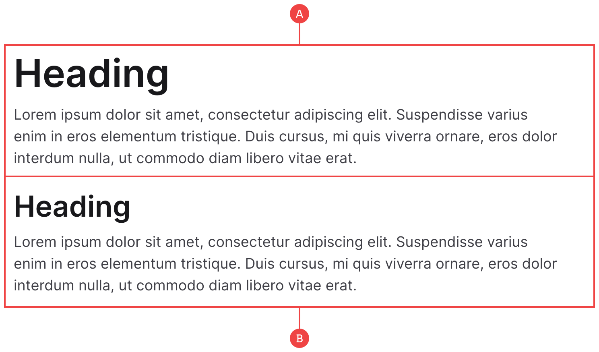

# Center Content

This is a really basic component, but it’s something we’ve found we use a lot but always seem to build differently each time. With that, we thought it would be better to just create a standardised way:

**A:** The main container of `center-content` has a max-width of 680px (68rem), and is set to margin auto in order to centre it.

**B:** Each paragraph block is a separate class so that you can have multiple heading levels and longform text within one container; great for pages such as the Privacy Policy.
