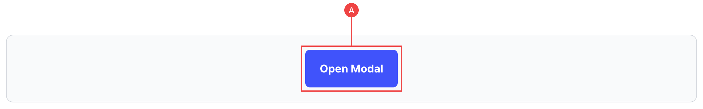
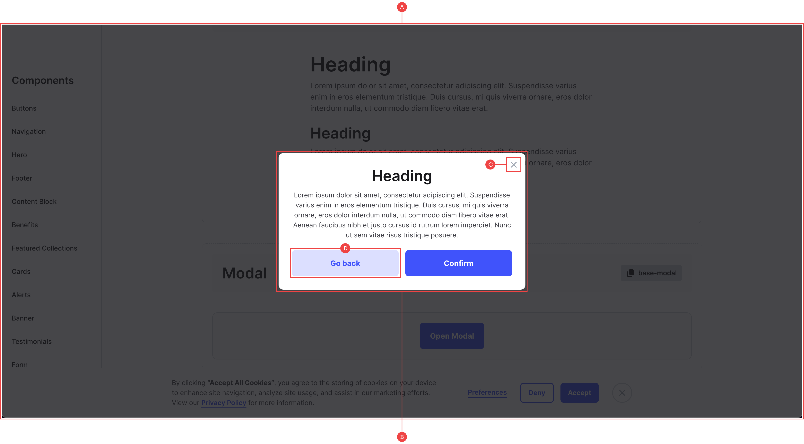

# Modal

The modal component has all of the functionality in place with the help of some simple JS toggle functions and Webflow interactions. We’ve set up a basic example trigger in the component library, however you can use a click event trigger on any element to open the modal:

## Trigger (Open)

**A:** We’ve added an example button to trigger the modal, but essentially, this click event just runs the ‘open’ interaction for the modal. This means you can add a click event to any item and select the `Modal (Open)` animation.

_This interaction also locks the page scroll by toggling the `no-scroll` class on the <html> tag. This prevents the page content from being accidentally scrolled when the modal is open._

## Modal (Main Wrapper)

**A:** The modal is contained within a top-level modal wrapper which needs to sit outside of the `main` container of the page. This wrapper houses both the overlay, and the actual modal, and is what is used to toggle the hidden state in the interaction.

**B:** The modal is first wrapped in its own container in order to give it some margin on smaller screens, and can contain any information you need. It must however have some sort of exit point such as a close icon or back button.

**C/D:** In the base component, we’ve added a close icon and back button which closes the modal and unlocks the page scroll with the help of our custom JS.
