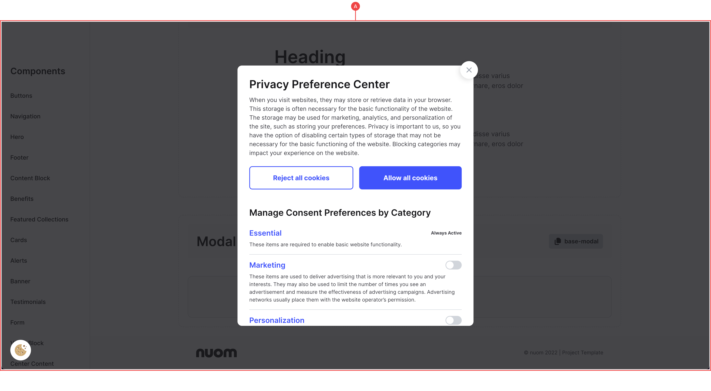
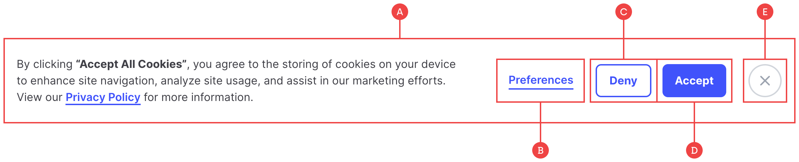
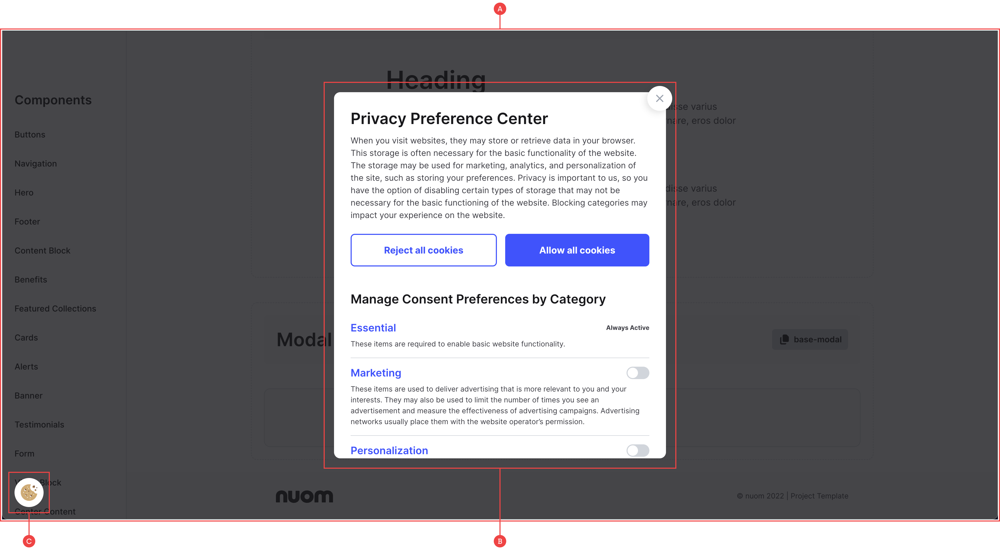

# Cookie Consent

Using FinSweet’s CDN, we’ve built a fully functional, GDPR compliant cookie consent that we can drag and drop into any project. With their “Cookie Oven”, we’ve also added some attributes to the cookie script to specify what we’d like to track such as analytics and marketing.

The whole component uses our own class names, so everything is styled correctly while still working with the FinSweet library. This means any changes you make to global components such as buttons should reflect in this component as well:

## Cookie Wrapper

**A:** Everything cookie related is housed within the `cookie-consent` wrapper, and is saved as a symbol that needs to be present on every page.

## Banner

**A:** The banner sits as a fixed component at the bottom and is first shown when the site loads, and is continually shown on each page load until you either accept or deny the cookies.

**B:** This launches the preferences form where you can specify your cookies permissions.

**C/D:** You can deny or accept the cookies to close the banner completely and never show again unless you clear your cache. You’ll also notice these buttons are our standard small buttons taken from the library as well.

**E:** You can simply hide the banner and open the preferences at any time using the cookie icon in the bottom left of the screen.

## Prefs Form

**A:** If you click the preferences link or the cookie icon, the cookie manager opens up as an overlay for you to turn on/off various tracking attributes.

**B:** You can see how the button and text styles translate into this form, and it’s here that you can manage everything or Reject/Accept the cookies.

**C:** The cookie icon triggers the interaction to open or close the prefs form at any stage until you either reject or accept the cookies.

_A lot of this functionality takes place behind the scenes of the CDN, however there are some noticeable interactions at play such as the Cookie Manager (Show/Close) animations that work natively in Webflow._

_It’s only styling changes you should need to make to this though, so the interactions and JS aren’t something we need to worry about — it’s why they call it FinSweet magic …_
