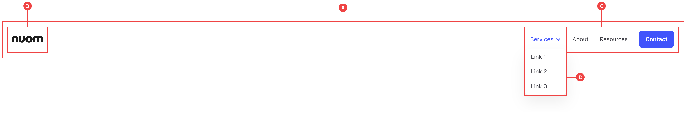
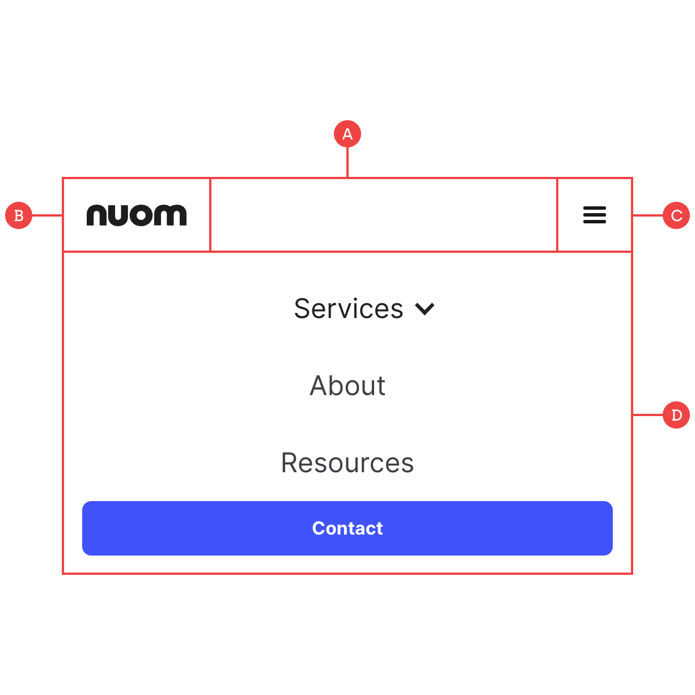

# Navigation

We have one basic navbar with all of the possible features in place, including a logo and nav menu with a dropdown link and button. This navbar is fully responsive:

## Navbar (Desktop)

**A:** The main parent that controls the position of the navbar and outer padding.

**B:** The logo/branding which also works as a backlink to the homepage.

**C:** The main nav links which includes both single and dropdown links, as well as a button. These links are then hidden on mobile and sit vertically as a menu overlay instead.

**D:** This menu list is absolutely positioned to allow it to sit under the main navbar, and can be toggled using the Show/Hide options under the settings panel.

## Navbar (Mobile)

**A:** The main parent that controls the position of the navbar and outer padding.

**B:** The logo/branding which also works as a link back to the homepage.

**C:** The menu trigger which is visible on mobile (Can be toggled using the Show/Hide options under the settings panel). This is an icon by default, but you can create your own custom menu within the `nav-menu__button` container (Just don’t remove this as it’s the trigger class for opening the menu).

**D:** The main nav links which include both single and dropdown links, as well as a button. On mobile, the nav link container becomes the dropdown menu that can be edited in any way, such as taking up the full viewport height.
