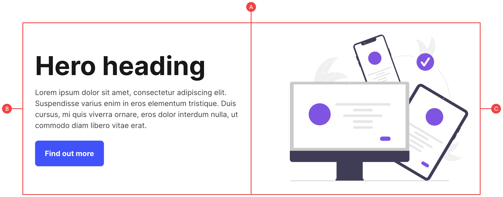
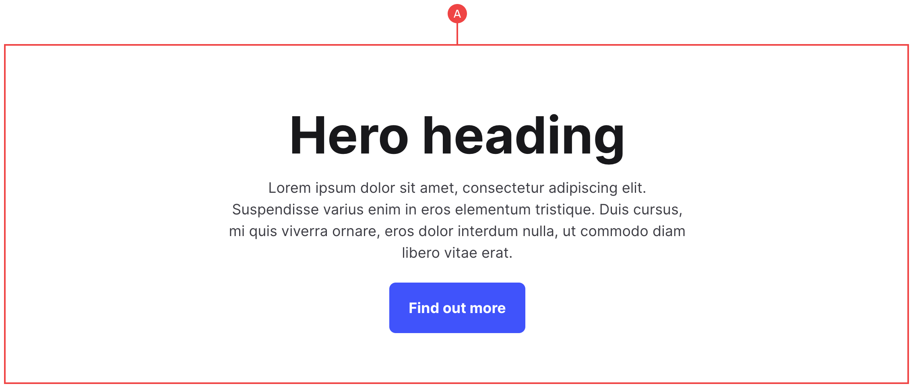

# Hero

The heroes have two variations based on the common patterns we’ve used. These include a hero grid with the text and image, and a simple centred hero with no image:

## Hero (With Image)

**A:** Making use of our custom grid classes, we have a basic two column layout which contains the hero title and copy, and an image.

**B:** The hero copy sits within its own container, and can be moved to the left or the right by either moving this layer in the layers panel, or by changing the order in the grid settings.

**C:** The image is a single image class that automatically sits in the other column.

## Hero (Without Image)

**A:** The hero container uses the modifier class of `center`, which simply centres all of the text and aligns the button to the middle.
