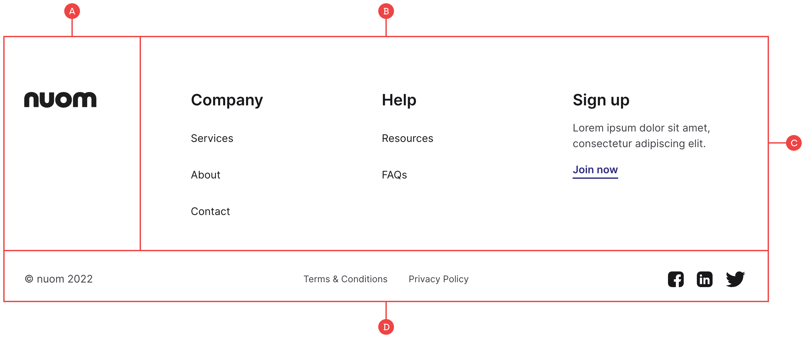

# Footer

Rather than give you an overly minimalist footer to begin with, we’ve opted to include everything you might need based on previous experience:

**A:** The footer is a separate section with the tag of `footer` so that it not only takes up the full viewport width, but is also more semantic.

**B:** The main container for the footer logo and links. This is split into two parts (The logo and the grid for the links), and uses Flexbox to control the horizontal and vertical positioning depending on the size of the screen.

**C:** With the help of our grid class, each title block can sit either horizontally or vertically depending on the size of the screen.

**D:** The bottom section is a three column grid which contains all of the secondary content including copyright info, sub links and social media icons. On smaller screens, we’ve made use of the manual [grid positioning](https://www.tutorialbrain.com/css_tutorial/grid_columns_grid_rows_grid_area/) which you can experiment with in the right-hand panel if needed.
