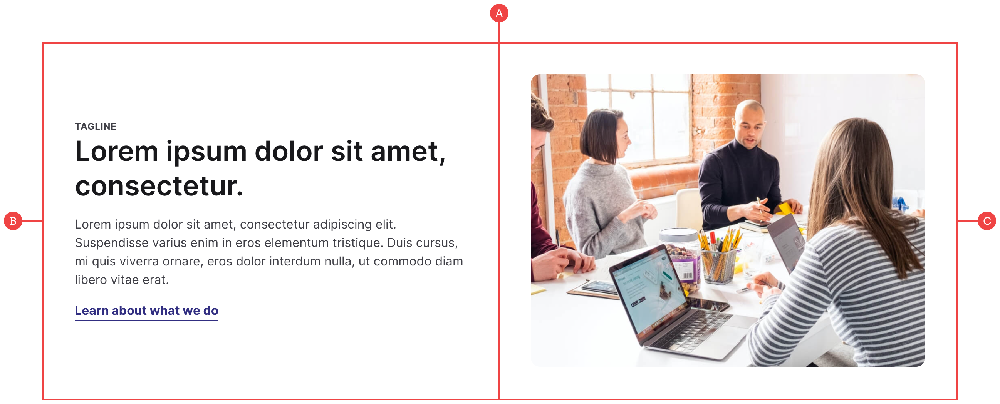
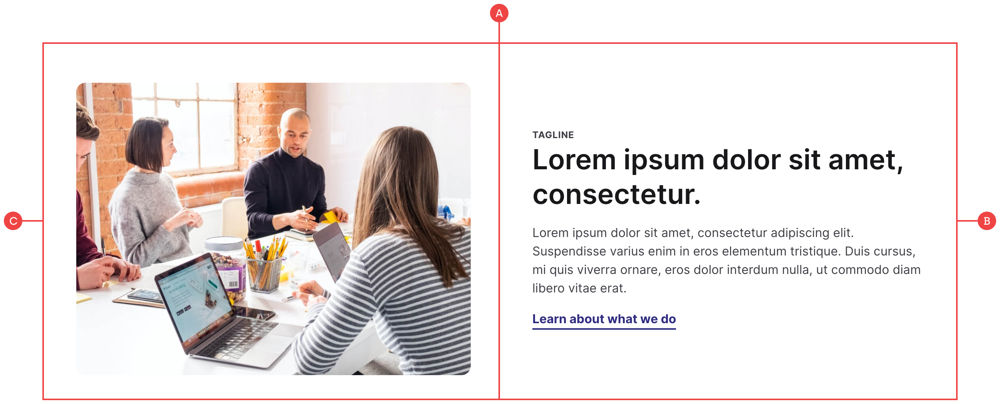

# Content Block

A very simple and common pattern which we’ve used across all of our projects in some form or another. We normally use a mix of left and right aligned blocks when necessary as well:

**A:** The main container is a two column grid which houses the copy and the image.

**B:** We’ve wrapped the copy in another div that can be moved to the left or the right by either moving this layer in the layers panel, or by changing the order in the grid settings.

**C:** The image is a single image class that automatically sits in the other column.
