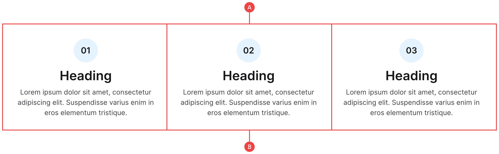
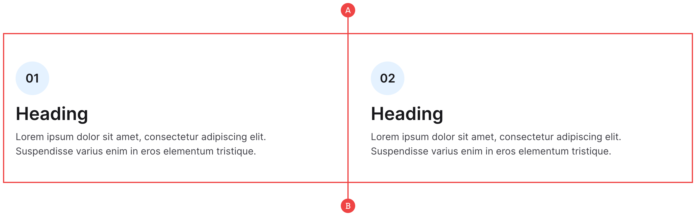

# Benefits

We’ve called these “Benefits”, however they’re good for any use case where you need to explain something in short snippets such as a step-by-step process. They are built using just three items wrapped within a vertical flex container:

## Benefits (Centre)

**A:** The benefits are wrapped in a three column container with the modifier of `benefit-grid-center` to keep the items aligned in the middle.

**B:** The benefit items are made up of an icon along with the heading and text, and use the modifier class of `center` in order to align the text correctly.

## Benefits (Left/Default)

**A:** The benefits are wrapped in a two column container, although they can also be in a three column container if needed.

**B:** The benefit items are made up of an icon along with the heading and text, and are left-aligned by default without the use of the `center` modifier.
