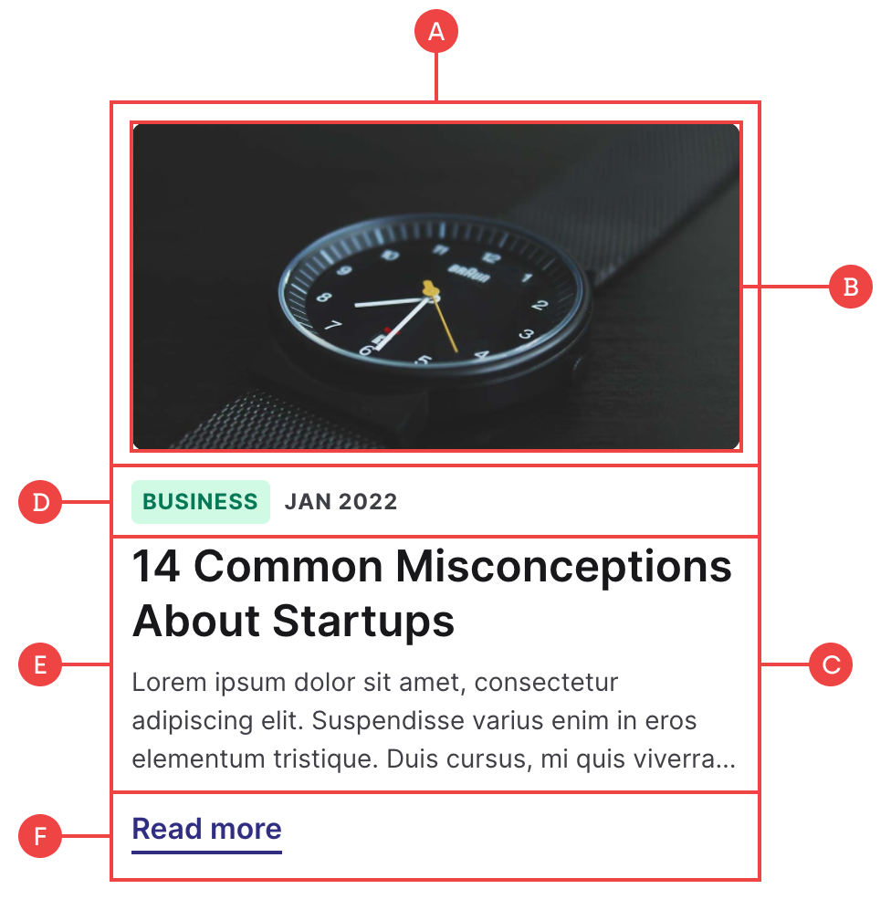

# Blog Cards

These cards are made up of five main elements that are all dynamically pulled from the blog CMS template we’ve set up:

**A:** To control the padding and hover states, the cards have a main container that also works as the link block which targets the current blog post for that item.

**B:** The image is dynamically pulled from the `Main Image` field in the `Blog Posts` collection.

**C:** So that the “Read more” item remains fixed to the bottom if the headings vary in line length, we have a `card__inner` flex wrapper with the justify set to `space-between`. If you want to remove the bottom item, then you can also remove this flex container.

**D:** The card details consist of two items wrapped within a flex container, and are dynamically linked to the `Category` and `Date` fields in the `Blog Posts` collection.

**E:** The heading and intro text are both dynamically linked to the `Title` and `Post Summary` fields in the `Blog Posts` collection. There is also some custom code that adds a line-clamp of 3 so that the text is truncated consistently on all cards.

**F:** The “Read more” is purely decorative, and can be removed if you want.
