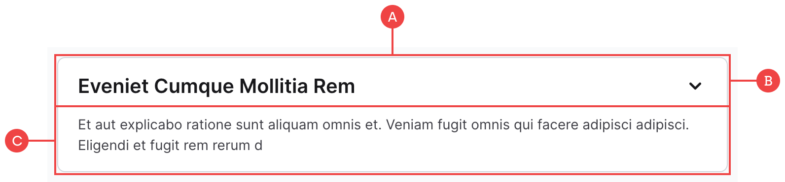

# FAQ Dropdown

These are one of the few components we have that require the native Webflow interactions, and you shouldn’t need to change much. These are also dynamic, but to keep things simple we’ve broken them into two main fields:

**A:** The main FAQ wrapper which controls the background colour and border.

**B:** The title contains the question and chevron, and is also the interaction trigger that opens and closes the answer. This title is pulled from the `Question` field in the `FAQ` collection.

**C:** The answer is linked to the `Answer` field in the `FAQ` collection, and is hidden by default. When the title above is triggered, the CSS changes this element to `display: block`. For some extra animation, we’ve also adjusted the opacity and set a delay so that it fades in and out.
