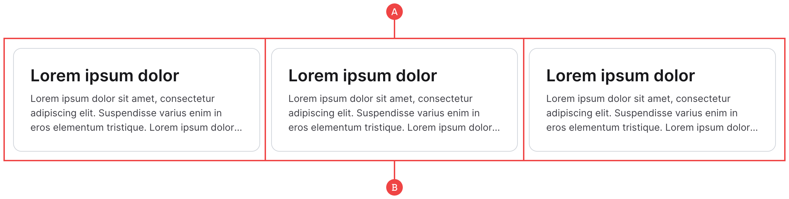

# Cards

We’ve created these so that you can add an image or extra item if needed, however the heading and text are often the most important and so they are the only elements included by default:

**A:** Cards often come in groups in our projects, so we have wrapped them in a three column container to begin with. We’d also suggest staying within two or three columns on larger screens to avoid the content looking too stretched or too cramped.

**B:** The card is made up of the main container, the inner content, and the heading and text. The reason we have the inner `card__content` wrapper is so that you can add an image to the card and adjust the padding of the text separately if needed.
