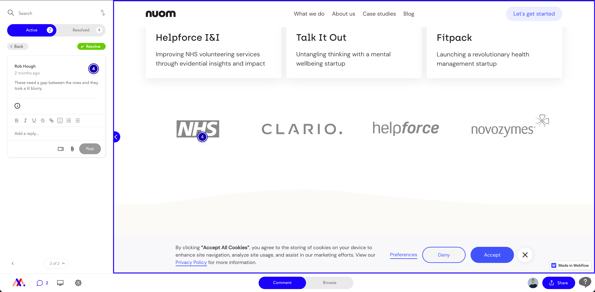
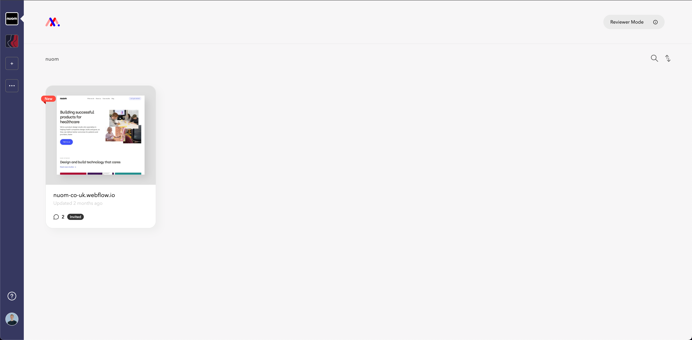

# Collecting Feedback

The cool thing about Webflow is the speed in which we can build our websites. This means that a lot of the time you reduce the gap between pushing pixels in Figma, and having a tangible, working version for the client to test and feedback on. The upside of using Figma to collect feedback however, is the commenting tool. Something Webflow doesn’t have...

We’ve often found that as clients test the website and spot any bugs or opportunities for design changes, they have to document their notes either in Notion, Slack, or a janky Google Doc.

As this feedback is separated from the project, you lose context as to what the note is referring to, meaning the client then has to add a screenshot or reference to the page/section the feedback is talking about

In the end, these docs often become bloated and hard to keep track of. (Sometimes new versions are created or documents get lost in emails as well), making the entire process more stressful than it needs to be.

## Using Markup.io

To overcome the above issues, we use [MarkUp](https://www.markup.io/), a free tool for commenting and collecting feedback on live websites.

You’ll notice the comment pins works exactly the same as in Figma, and we’re able to easily create comment threads directly on the website which is a much more effective way of collaborating with the client.

We even have our own team dashboard like we do for both Figma and Webflow, so it’s all very familiar which is a bonus:

This is the team dashboard while you’re in reviewer mode (The mode you’ll most likely be using), so when we kick-off a new website you’ll be invited to collaborate on the project along with the client/stakeholders. From there, your active projects will then show up on here.

_Your first invite may prompt you to create an account, so you can simply sign-in with your nuom Google account and add a profile picture etc._

You can also request the main login details if you want to set-up a project yourself as the nuom admin, so that’s not an issue. You’ll also get your own space to add any sites/projects outside of the nuom team:

## Navigating the website in MarkUp

When you connect a URL to MarkUp, it creates an embedded web-viewer in which you can navigate around and use the site as you normally would. To switch between comment mode and browse mode, you use the toggle options at the bottom of the viewer:

Any changes you publish in Webflow will also reflect live here as well, so once the site is connected you don’t have to mess around with pulling in updated version's etc.

There’s even a responsive mode, so you can capture feedback at different sizes as well:

If you want to add more people to the project, it’s just a case of sharing the project either through their email address, or via the project link:

<aside>
💡 The project URL we use is the staging link, as we can bug test, experiment and make changes for people to feedback on all within MarkUp. That way we can be sure the main site is running fine and that we’re only pushing finalised stuff live.
</aside>
